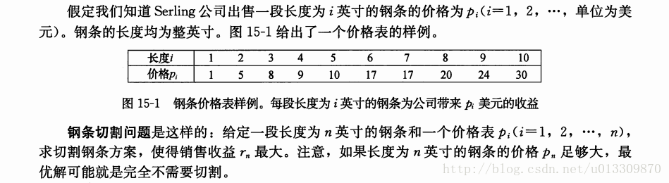

# 题目


# 求解

使用动态规划求解

## 动态规划函数
$ r_n = \max \limits_{1\leq i\leq n}(p_i + r_{n-i}) $

## 动态规划数组
$r_i$用于表示长度为i的钢条的销售最大解。 用一个长度为n+1的数组表示
``` c++
r[0] = 0;
for (int i = 1; i <= n; ++i) {}
    ri = INT_MIN;
    for (int j = 1; j <= i; ++j) {
        ri = max (ri, p[j] + r[i-j]);
    }
    r[i] = ri;
}
```